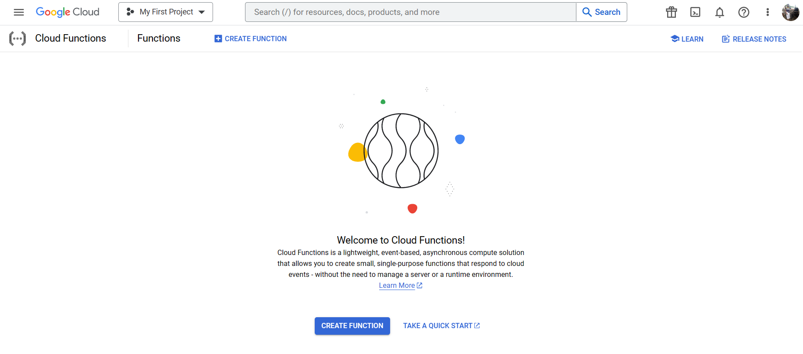
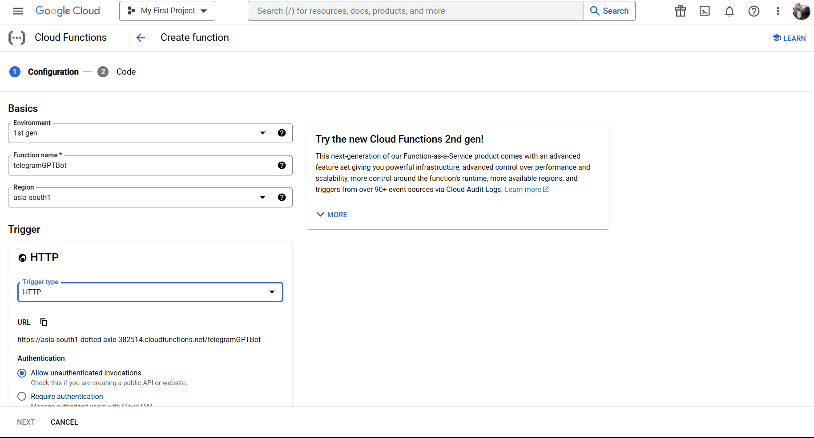
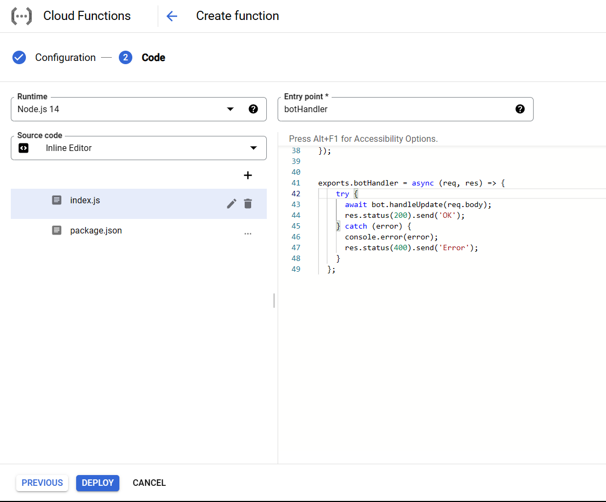
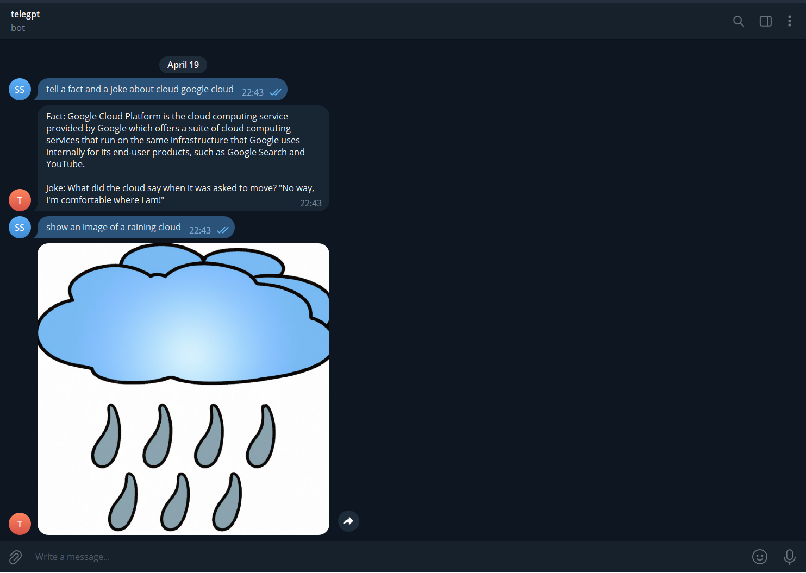

## Deploying a telegram bot using Cloud functions

* Deploying a telegram bot using Cloud functions is a much simpler process than the previous 2 deployments.
* To start with, go to the [Cloud Functions](https://console.cloud.google.com/functions/list) page and click on the `Create Function` button.

* In the next page, set the `Environment` to `1rst gen` and set the `Function Name`. Allow the `Allow unauthenticated invocations` option, set the `Trigger` to `HTTP` and set the `Environment variables` and `Build variables`.

* Now, click on the `Create` button. In the next page, set the `Runtime` to `Node.js 14` and set the `Entry point` as the function name which is exported. Set the `Source code` as `Inline editor` and paste the code in the `index.js` file. Also update the `package.json` file with the dependencies and then, click on the `Deploy` button.

* Now, the bot is deployed on the cloud functions!🥳

* But the bot is not yet available to the public. To make the bot available to the public, we need to set up the webhook. For this, first remove the webhooks present for the bot by sending the following request to the telegram bot API:
```bash
curl -X POST https://api.telegram.org/bot<token>/deleteWebhook
```
* Then, set the webhook by sending the following request to the telegram bot API:
```bash
curl -X POST https://api.telegram.org/bot<token>/setWebhook?url=<url>
```
* In the above request, `<token>` is the token of the telegram bot and `<url>` is the url of the cloud function.
* Now, the bot is available to the public!🥳

* You can check out the telegram bot [here](https://t.me/telegptv1_bot).